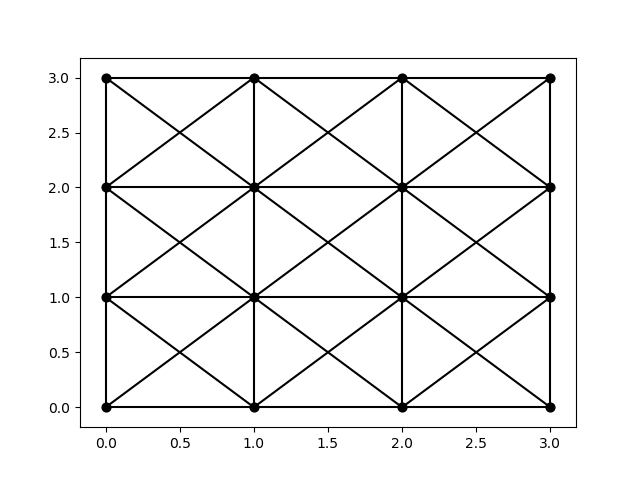
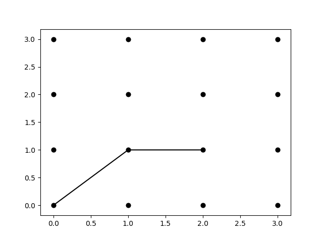

# dwave-traceroute

Разработка программы трассировки печатных плат на квантовом компъютере DWave

## Установка.

    git clone https://github.com/maslovvladimir/dwave-traceroute.git

## Параметры.
На данный момент программа работает с сеткой 4x4

Сетка создается фунуцией

    g = Grid.CreateGridGraph(4,4,obstacle )
    
    obstacle - список фершин препятсвия которые удаляются из графа
    сетки
    
сетку можно вывести на экран функцией

    Grid.PlotGrid(g)

 

Координнаты задаются в виде:
(ряд, колонка).

Например: провести трассу от точки (0,0) до (1,2)

    res = Trace(g, (0,0),(1,2))
    
Для прорисовки результата используется функция

    Grid.PlotTrace(g, res)    
  
   
## Запуск.
    python Tracer.py
